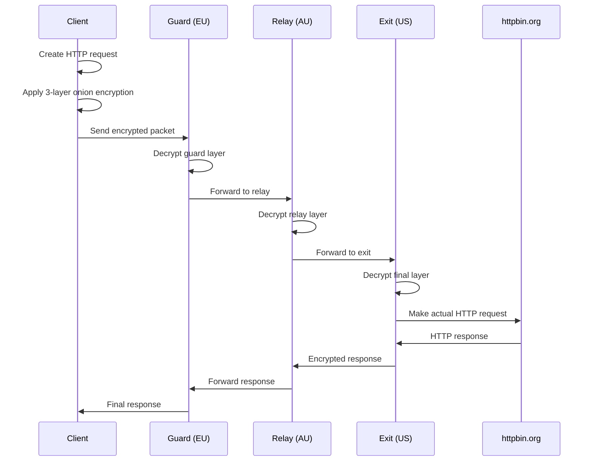

# 🧅 Onion Network - Anonymous Routing System


**Developed by:** Aryan

A production-grade Tor-like onion routing implementation in Go, providing multi-layer encryption and anonymous internet access through globally distributed nodes.

## 📋 Table of Contents

- [Overview](#-overview)
- [Architecture](#️-architecture)
- [System Flow](#-system-flow)
- [Prerequisites](#️-prerequisites)
- [Quick Start](#-quick-start)
- [Azure Deployment](#️-azure-deployment)
- [Testing](#-testing)
- [Security](#-security)
- [Troubleshooting](#-troubleshooting)
- [References](#-references)

## 🎯 Overview

This onion network provides true internet anonymity by routing traffic through multiple encrypted hops across different geographical locations. Unlike VPNs that only provide single-hop encryption, this system implements Tor-like onion routing with multiple layers of RSA + AES encryption.

### Key Features

- **Multi-layer Encryption**: RSA-2048 + AES-256-GCM hybrid encryption
- **Global Distribution**: Nodes deployed across Europe, Australia, and USA
- **Real-time Circuit Creation**: Dynamic path selection through available nodes
- **Directory Service**: Centralized node discovery and registration
- **Production Ready**: Deployed on Microsoft Azure with real IP transparency

### Traffic Flow

```
You → 🇪🇺 Guard (Europe) → 🇦🇺 Relay (Australia) → 🇺🇸 Exit (USA) → Internet
```

## 🏗️ Architecture

### System Overview

```mermaid
graph TB
    Client[👤 Client<br/>Local Machine]
    Directory[📋 Directory Server<br/>172.191.95.78:9000<br/>🇺🇸 East US]
    Guard[🛡️ Guard Node<br/>172.201.12.43:8080<br/>🇪🇺 West Europe]
    Relay[🔄 Relay Node<br/>68.218.3.154:8081<br/>🇦🇺 Australia East]
    Exit[🚪 Exit Node<br/>172.191.84.146:8082<br/>🇺🇸 East US]
    Internet[🌐 Internet<br/>Target Website]

    Client -->|1. Register & Discover| Directory
    Directory -->|Node List| Client
    Client -->|2. Create Circuit| Guard
    Guard -->|Forward| Relay
    Relay -->|Forward| Exit
    Exit -->|3. HTTP Request| Internet
    Internet -->|Response| Exit
    Exit -->|Response| Relay
    Relay -->|Response| Guard
    Guard -->|Response| Client

    style Client fill:#e1f5fe
    style Directory fill:#fff3e0
    style Guard fill:#e8f5e8
    style Relay fill:#fff9c4
    style Exit fill:#fce4ec
    style Internet fill:#f3e5f5
```



### Component Architecture


### Encryption Flow


## 🔄 System Flow

### 1. Node Registration


### 2. Circuit Creation

```mermaid
sequenceDiagram
    participant C as Client
    participant D as Directory Server

    C->>D: GET /nodes/guard
    D->>C: Guard node list
    C->>D: GET /nodes/relay  
    D->>C: Relay node list
    C->>D: GET /nodes/exit
    D->>C: Exit node list
    C->>C: Select path: Guard → Relay → Exit
    C->>C: Create circuit ID
```


### 3. Request Processing


## 🛠️ Prerequisites

### Local Development
- Go 1.21 or higher
- Git
- Terminal/Command Line access

### Azure Deployment
- Microsoft Azure account ($100 student credit recommended)
- Azure CLI installed and configured
- SSH key pair generated

### System Requirements
| Component | VM Size | vCPU | RAM | Monthly Cost |
|-----------|---------|------|-----|--------------|
| Directory Server | Standard_B1s | 1 | 1GB | $7.30 |
| Guard Node | Standard_B1s | 1 | 1GB | $7.30 |
| Relay Node | Standard_B1s | 1 | 1GB | $7.30 |
| Exit Node | Standard_B1s | 1 | 1GB | $7.30 |
| **Total** | | **4** | **4GB** | **$29.20** |

## ⚡ Quick Start

### Local Testing (Single Machine)

1. **Clone and Build**
   ```bash
   git clone <repository>
   cd onion-network
   go build -o onion-network
   ```

2. **Start Directory Server**
   ```bash
   ./onion-network -mode=directory -port=9000
   ```

3. **Start Nodes** (separate terminals)
   ```bash
   # Guard Node
   ./onion-network -mode=node -type=guard -port=8080
   
   # Relay Node
   ./onion-network -mode=node -type=relay -port=8081
   
   # Exit Node
   ./onion-network -mode=node -type=exit -port=8082
   ```

4. **Test Client**
   ```bash
   ./onion-network -mode=client
   create
   request https://httpbin.org/ip
   quit
   ```

## ☁️ Azure Deployment

### Step 1: Infrastructure Setup

1. **Install Azure CLI**
   ```bash
   brew install azure-cli  # macOS
   # or visit: https://docs.microsoft.com/en-us/cli/azure/install-azure-cli
   ```

2. **Login and Create Resource Group**
   ```bash
   az login
   az group create --name onion-network-rg --location eastus
   ```

3. **Create VMs**
   ```bash
   # Directory Server (East US)
   az vm create \
     --resource-group onion-network-rg \
     --name directory-server \
     --location eastus \
     --image Ubuntu2204 \
     --size Standard_B1s \
     --admin-username onion \
     --generate-ssh-keys \
     --public-ip-sku Standard

   # Guard Node (West Europe)
   az vm create \
     --resource-group onion-network-rg \
     --name guard-node-eu \
     --location westeurope \
     --image Ubuntu2204 \
     --size Standard_B1s \
     --admin-username onion \
     --generate-ssh-keys \
     --public-ip-sku Standard

   # Relay Node (Australia East)
   az vm create \
     --resource-group onion-network-rg \
     --name relay-node-au \
     --location australiaeast \
     --image Ubuntu2204 \
     --size Standard_B1s \
     --admin-username onion \
     --generate-ssh-keys \
     --public-ip-sku Standard

   # Exit Node (East US)
   az vm create \
     --resource-group onion-network-rg \
     --name exit-node-us \
     --location eastus \
     --image Ubuntu2204 \
     --size Standard_B1s \
     --admin-username onion \
     --generate-ssh-keys \
     --public-ip-sku Standard
   ```

4. **Open Network Ports**
   ```bash
   az vm open-port --resource-group onion-network-rg --name directory-server --port 9000 --priority 1100
   az vm open-port --resource-group onion-network-rg --name guard-node-eu --port 8080 --priority 1100
   az vm open-port --resource-group onion-network-rg --name relay-node-au --port 8081 --priority 1100
   az vm open-port --resource-group onion-network-rg --name exit-node-us --port 8082 --priority 1100
   ```

### Step 2: Build and Deploy

1. **Build for Linux**
   ```bash
   GOOS=linux GOARCH=amd64 go build -o onion-network-linux
   ```

2. **Deploy to Servers**
   ```bash
   # Get VM IP addresses
   az vm list-ip-addresses --resource-group onion-network-rg --output table
   
   # Deploy binary (replace with actual IPs)
   scp onion-network-linux onion@DIRECTORY_IP:~/
   scp onion-network-linux onion@GUARD_IP:~/
   scp onion-network-linux onion@RELAY_IP:~/
   scp onion-network-linux onion@EXIT_IP:~/
   ```

### Step 3: Start the Network

**Start services in this exact order:**

1. **Directory Server**
   ```bash
   ssh onion@DIRECTORY_IP
   chmod +x onion-network-linux
   ./onion-network-linux -mode=directory -port=9000
   ```

2. **Guard Node** (wait 30 seconds)
   ```bash
   ssh onion@GUARD_IP
   chmod +x onion-network-linux
   ./onion-network-linux -mode=node -type=guard -port=8080
   ```

3. **Relay Node**
   ```bash
   ssh onion@RELAY_IP
   chmod +x onion-network-linux
   ./onion-network-linux -mode=node -type=relay -port=8081
   ```

4. **Exit Node**
   ```bash
   ssh onion@EXIT_IP
   chmod +x onion-network-linux
   ./onion-network-linux -mode=node -type=exit -port=8082
   ```

## 🧪 Testing

### Basic Functionality Test

1. **Start Client**
   ```bash
   ./onion-network -mode=client
   ```

2. **Create Circuit**
   ```
   onion> create
   Created circuit circuit_abc123: node_guard -> node_relay -> node_exit
   ```

3. **Make Anonymous Request**
   ```
   onion> request https://httpbin.org/ip
   Making request to https://httpbin.org/ip via circuit circuit_abc123
   🧅 Creating onion encryption layers...
   🔒 Encrypting request with 3 layers...
   📦 Encrypted packet size: 910 bytes
   ✅ Encrypted request sent successfully!
   ```

### Expected Server Activity

**Guard Node Log:**
```
[GUARD] Received 910 bytes of data
[GUARD] 🔓 Successfully decrypted layer, forwarding to relay
[GUARD] ✅ Successfully forwarded to RELAY
```

**Relay Node Log:**
```
[RELAY] Received 626 bytes of data
[RELAY] 🔓 Successfully decrypted layer, forwarding to exit
[RELAY] ✅ Successfully forwarded to EXIT
```

**Exit Node Log:**
```
[EXIT] Received 342 bytes of data
[EXIT] 🔓 Successfully decrypted final layer
[EXIT] 🌐 Making REAL request to: https://httpbin.org/ip
[EXIT] ✅ SUCCESS! Got 30 bytes from https://httpbin.org/ip
[EXIT] 📊 Response Status: 200 OK
[EXIT] 📋 Response Preview: {"origin": "172.191.84.146"}
```

### Anonymity Verification

The response shows the **exit node's IP** (172.191.84.146), not your real IP.

Test with multiple services:
```
request https://httpbin.org/ip
request https://api.ipify.org?format=json
request https://ifconfig.me/ip
```

## 🔒 Security

### What This Provides

✅ **IP Address Anonymity**: Websites see exit node IP, not yours  
✅ **Traffic Encryption**: Multi-layer RSA + AES encryption  
✅ **Geographic Distribution**: Traffic routes through multiple countries  
✅ **No Single Point of Failure**: Distributed architecture  

### Security Architecture

```mermaid
graph TB
    subgraph "🔐 Encryption Layers"
        L1[Layer 1: AES-256-GCM<br/>Exit Node Key]
        L2[Layer 2: AES-256-GCM<br/>Relay Node Key]  
        L3[Layer 3: AES-256-GCM<br/>Guard Node Key]
    end
    
    subgraph "🔑 Key Management"
        K1[RSA-2048 Keys<br/>Generated per node]
        K2[AES Keys<br/>Generated per session]
        K3[Perfect Forward Secrecy<br/>Keys rotated on restart]
    end
    
    Data[📄 Original Data] --> L1
    L1 --> L2
    L2 --> L3
    L3 --> Encrypted[🔒 3-Layer Encrypted Onion]
    
    K1 --> K2
    K2 --> K3
```



### Best Practices

- **Monitor Logs**: Watch for unusual activity
- **Regular Updates**: Keep Azure VMs updated
- **Cost Monitoring**: Track Azure spending
- **Key Rotation**: Restart nodes periodically

## 🔧 Troubleshooting

### Common Issues

#### Connection Refused
```
❌ Failed to send request: dial tcp: connect: connection refused
```

**Solutions:**
1. Verify all nodes are running
2. Check firewall ports (9000, 8080, 8081, 8082)
3. Ensure nodes listen on `0.0.0.0`, not `127.0.0.1`
4. Start services in correct order

#### Decryption Error
```
❌ Failed to decrypt layer: crypto/rsa: decryption error
```

**Solutions:**
1. Create fresh circuit after restarting nodes
2. Ensure all nodes running latest binary
3. Check node registration with directory

#### Registration Failed
```
Warning: Failed to register with directory: connection refused
```

**Solutions:**
1. Start directory server first
2. Wait 30 seconds before starting nodes
3. Verify directory server port 9000 is accessible

### Debugging Commands

```bash
# Check process status
ssh onion@SERVER_IP "ps aux | grep onion"

# Check port listening
ssh onion@SERVER_IP "ss -tlnp | grep PORT"

# Monitor network traffic
ssh onion@SERVER_IP "iftop"

# Monitor resources
ssh onion@SERVER_IP "htop"
```

## 📚 References

### Research Papers

1. **Dingledine, R., Mathewson, N., & Syverson, P. (2004)**  
   *Tor: The Second-Generation Onion Router*  
   USENIX Security Symposium  
   [Paper Link](https://www.usenix.org/legacy/publications/library/proceedings/sec04/tech/full_papers/dingledine/dingledine.pdf)

2. **Goldschlag, D., Reed, M., & Syverson, P. (1999)**  
   *Onion Routing for Anonymous and Private Internet Connections*  
   Communications of the ACM, 42(2), 39-41  
   [Paper Link](https://www.onion-router.net/Publications/CACM-1999.pdf)

3. **Syverson, P., Tsudik, G., Reed, M., & Landwehr, C. (2000)**  
   *Towards an Analysis of Onion Routing Security*  
   Workshop on Design Issues in Anonymity and Unobservability  
   [Paper Link](https://www.onion-router.net/Publications/WDIAU-2000.pdf)

## 📚 Additional Information

### File Structure
```
onion-network/
├── main.go                 # Entry point and CLI
├── go.mod                  # Go module definition
├── pkg/
│   ├── node/              # Node implementation
│   │   └── node.go        # Guard/Relay/Exit logic
│   ├── client/            # Client implementation  
│   │   └── client.go      # Circuit creation & requests
│   ├── directory/         # Directory service
│   │   └── directory.go   # Node registration & discovery
│   ├── circuit/           # Circuit management
│   │   └── circuit.go     # Circuit creation & selection
│   ├── crypto/            # Encryption engine
│   │   └── onion.go       # Multi-layer encryption
│   └── message/           # Message types
│       └── message.go     # Protocol definitions
├── README.md              # This file
└── DEMO-GUIDE.md         # Step-by-step demo guide
```

### Quick Reference Commands

**Start Production Network:**
```bash
# 1. Directory (first)
ssh onion@172.191.95.78 "./onion-network-linux -mode=directory -port=9000"

# 2. Guard (wait 30s)  
ssh onion@172.201.12.43 "./onion-network-linux -mode=node -type=guard -port=8080"

# 3. Relay
ssh onion@68.218.3.154 "./onion-network-linux -mode=node -type=relay -port=8081"

# 4. Exit
ssh onion@172.191.84.146 "./onion-network-linux -mode=node -type=exit -port=8082"
```

**Test Client:**
```bash
./onion-network -mode=client
create
request https://httpbin.org/ip
quit
```

**Emergency Shutdown:**
```bash
az vm deallocate --resource-group onion-network-rg --name directory-server
az vm deallocate --resource-group onion-network-rg --name guard-node-eu  
az vm deallocate --resource-group onion-network-rg --name relay-node-au
az vm deallocate --resource-group onion-network-rg --name exit-node-us
```

---